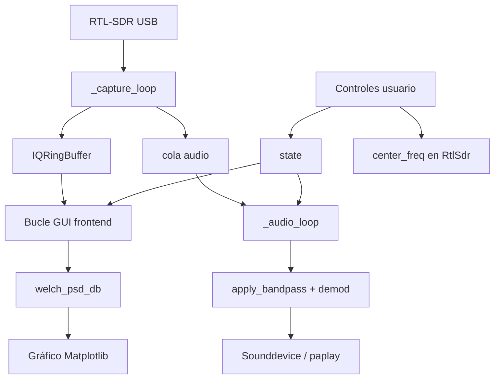

# Lab SDR

Aplicación de laboratorio para visualizar el espectro en tiempo real con un **RTL-SDR** y escuchar señales AM/FM demoduladas. El código está organizado en capas **Backend** (datos, DSP, hardware) y **Frontend** (interfaz Matplotlib).

---

## Estructura de carpetas

```
lab_sdr/
├── main.py              # Punto de entrada (único script en la raíz)
├── requirements.txt     # Dependencias Python
├── README.md
├── lab_sdr.py.bak       # Respaldo del script monolítico original (no ejecutar)
├── venv/                # Entorno virtual (opcional, local)
└── src/                 # Paquete con toda la lógica de la aplicación
    ├── __init__.py
    ├── config.py        # Constantes: frecuencias, buffers, FFT, audio
    ├── backend.py       # RTL-SDR, DSP, hilos, pipeline, salida de audio
    └── frontend.py      # GUI Matplotlib y bucle de actualización del espectro
```

### Rol de cada módulo

| Archivo | Capa | Responsabilidad |
|---------|------|-----------------|
| `main.py` | Entrada | Orquesta inicio, GUI y apagado seguro del hardware |
| `src/config.py` | Configuración | Constantes globales (sin lógica ejecutable) |
| `src/backend.py` | Backend | Captura IQ, procesamiento de señal, audio, métricas PSD |
| `src/frontend.py` | Frontend | Gráficos, controles, interacción con el usuario |

---

## Arquitectura

El diseño separa **presentación** y **lógica** para que el DSP y los hilos de captura no dependan de Matplotlib.

```
┌─────────────────────────────────────────────────────────────┐
│  main.py (raíz)                                             │
│    initialize_sdr_system()  →  run_gui()  →  shutdown()     │
└──────────────┬──────────────────────────────┬───────────────┘
               │                              │
               ▼                              ▼
┌──────────────────────────┐   ┌────────────────────────────┐
│  src/backend.py          │   │  src/frontend.py           │
│  • open_rtlsdr()         │   │  • Figura y widgets        │
│  • SDRPipeline (hilos)   │   │  • Bucle while + plt.pause │
│  • welch_psd_db, filtros │◄──│  • Lee spectrum_ring       │
│  • AudioProcessor        │   │  • Escribe en state / sdr  │
└──────────────────────────┘   └────────────────────────────┘
               │
               ▼
┌──────────────────────────┐
│  src/config.py           │
│  Constantes compartidas  │
└──────────────────────────┘
```

---

## Flujo del código (arranque a apagado)

### 1. Inicio (`main.py`)

1. Llama a `initialize_sdr_system()` en el backend.
2. Pasa el SDR, el buffer de espectro, el pipeline, el reproductor de audio y el diccionario `state` a `run_gui()`.
3. En `finally`, llama a `shutdown_sdr_system()` para detener hilos, audio y cerrar el dongle.

### 2. Inicialización del backend (`initialize_sdr_system`)

1. **Abre el RTL-SDR** (`open_rtlsdr`): detecta dongles, configura tasa de muestreo, frecuencia central y ganancia.
2. Crea un **`IQRingBuffer`** grande (~1 M muestras) para el espectro.
3. Instancia **`SDRPipeline`**, que arranca dos hilos en segundo plano:
   - **Hilo de captura** (`_capture_loop`): lee bloques IQ del USB, los escribe en el anillo y los encola para audio.
   - **Hilo de audio** (`_audio_loop`): fusiona bloques, aplica pasabanda, demodula AM/FM y envía PCM al reproductor (si está activo).
4. Crea el **reproductor de audio** (`sounddevice` o `paplay`) y lo enlaza al pipeline con callbacks de ganancia y modo de demodulación.
5. Devuelve un diccionario **`state`** compartido con la GUI (frecuencia, span, filtros, promedios PSD, etc.).

### 3. Interfaz gráfica (`run_gui`)

1. Construye la figura Matplotlib: espectro total, traza filtrada, banda verde del pasabanda y panel de métricas.
2. Añade **TextBox**, **Button** y **RadioButtons** (frecuencia RTL, offset del filtro, ancho de banda, span, volumen, AM/FM, Escuchar).
3. Entra en un **`while True`**:
   - Cada ~8 Hz (`PSD_UPDATE_HZ`): lee IQ del anillo, calcula PSD con Welch, suaviza con media exponencial, aplica filtro “one-shot” para la curva verde y actualiza métricas (−3 dB, potencia, etc.).
   - Cada iteración: `plt.pause(0.02)` para mantener la ventana responsive.
   - El audio **no** se procesa aquí; sigue en el hilo dedicado del backend.

### 4. Apagado (`shutdown_sdr_system`)

1. Señala parada al pipeline y espera a los hilos.
2. Cierra el stream de audio.
3. Libera el RTL-SDR con `sdr.close()`.

---

## Flujo de datos en tiempo de ejecución



**Desacople importante:** el espectro usa un buffer grande y actualización a 8 Hz; el audio usa bloques pequeños (~54 ms) y un hilo separado para evitar bloqueos en la GUI.

---

## Procesamiento de señal (backend)

Resumen de las piezas principales en `src/backend.py` (sin alterar la lógica original):

| Función / clase | Uso |
|-----------------|-----|
| `welch_psd_db` | Densidad espectral (Welch + Hann, FFT 8192) |
| `apply_bandpass` | Pasabanda IQ por mezcla + SOS Butterworth |
| `fm_demod` / `am_demod` | Demodulación para audio |
| `AudioProcessor` | Cadena FM/AM, deénfasis, AGC lento |
| `measure_signal` | Fc, BW −3 dB y potencia en banda |
| `IQRingBuffer` | Buffer circular thread-safe para PSD |
| `SDRPipeline` | Orquestación de captura y audio en hilos |

Los parámetros numéricos (frecuencias, ganancia, tamaños de buffer, órdenes de filtro) están en `src/config.py`.

---

## Requisitos e instalación

**Hardware:** dongle RTL-SDR (p. ej. RTL2832 + R820T).

**Software (Python 3.10+):**

```bash
cd /home/zerendor/lab_sdr
python3 -m venv venv
source venv/bin/activate
pip install -r requirements.txt
```

Dependencias principales: `numpy`, `scipy`, `matplotlib`, `pyrtlsdr`, `sounddevice` (opcional).

**Linux — evitar conflicto con driver DVB:**

```bash
sudo modprobe -r dvb_usb_rtl28xxu
```

**Audio alternativo:** si no hay `sounddevice`, puede usarse `paplay` (PulseAudio):

```bash
sudo apt install pulseaudio-utils
```

---

## Ejecución

Siempre desde la **raíz del proyecto** (para que Python resuelva el paquete `src`):

```bash
cd /home/zerendor/lab_sdr
source venv/bin/activate
python main.py
```

Detener con **Ctrl+C**.

### Uso rápido de la interfaz

- **RTL central (MHz):** frecuencia del sintonizador del dongle.
- **Δf filtro (kHz):** desplazamiento del pasabanda respecto al centro RTL.
- **Ancho BW (kHz):** ancho del filtro y canal demodulado.
- **Span (MHz):** ventana visible del eje X del espectro.
- **Auto:** centra el filtro en el pico visible.
- **AM / FM:** modo de demodulación de audio.
- **Escuchar:** activa audio (emite un pitido de prueba al encender).

---

## Respaldo

`lab_sdr.py.bak` conserva el script monolítico original con fines de referencia. **No debe ejecutarse**; el punto de entrada oficial es `main.py`.

